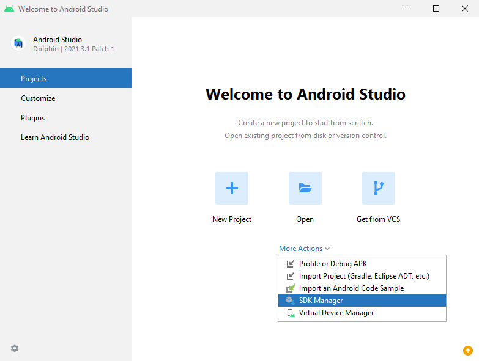
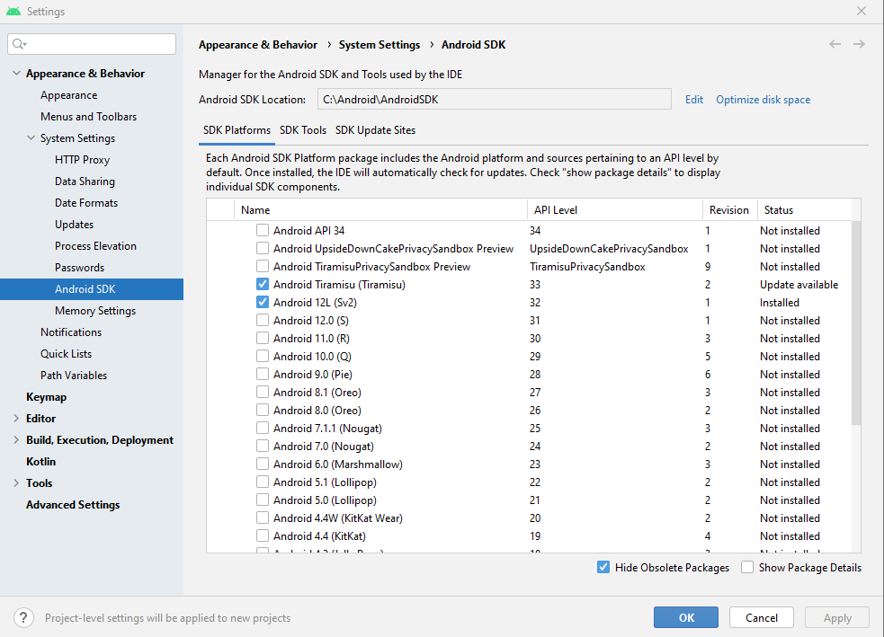
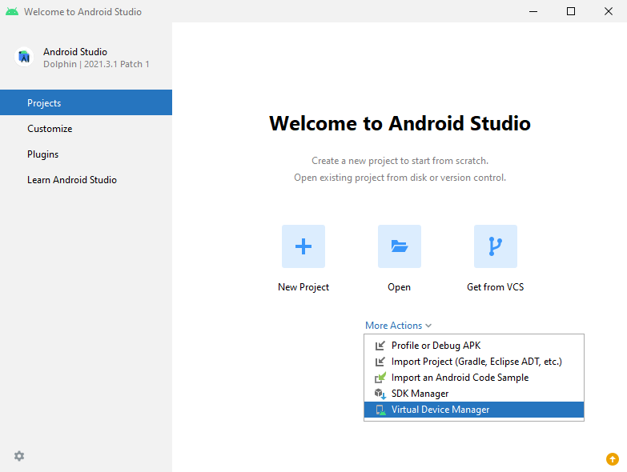
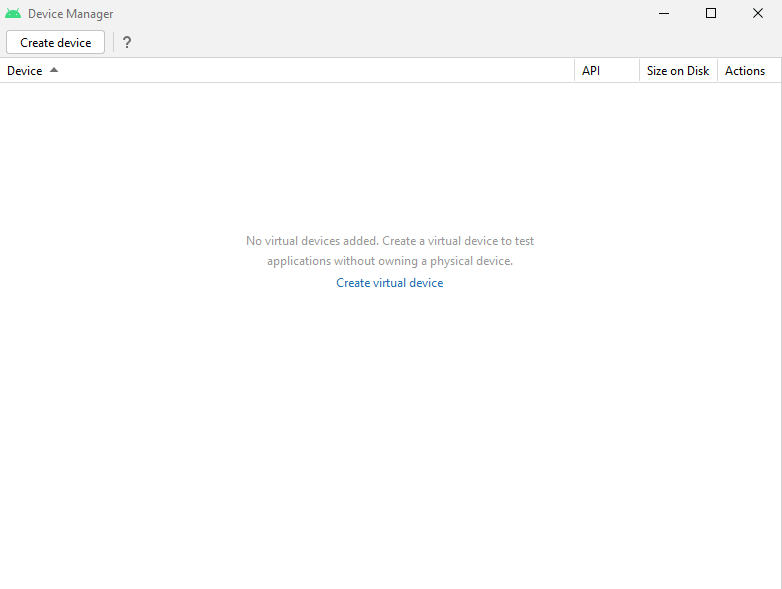
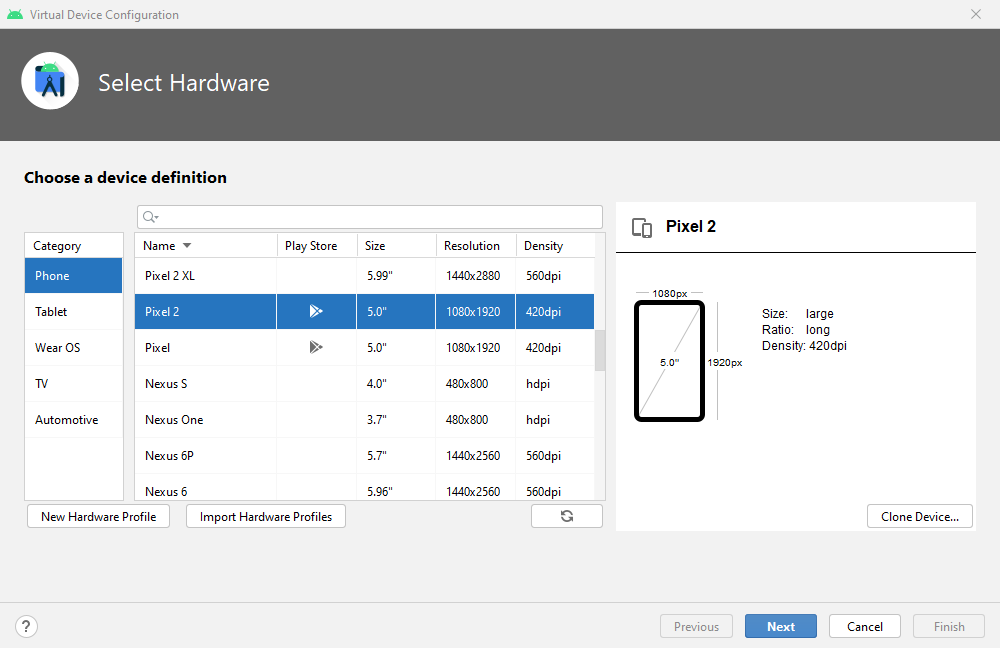
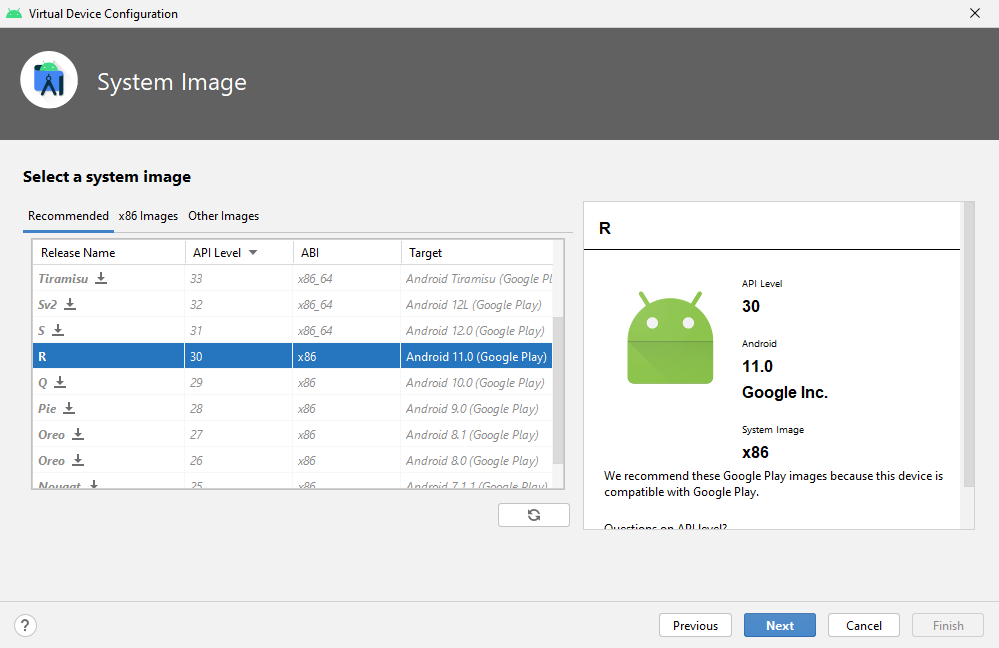
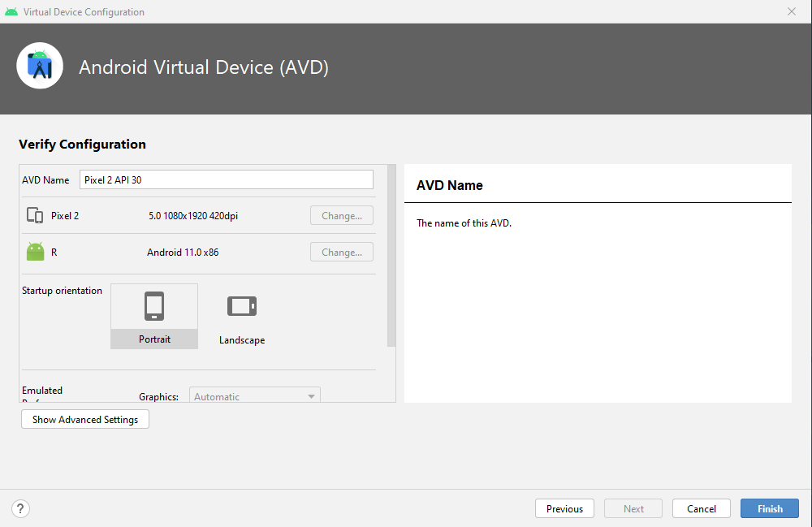
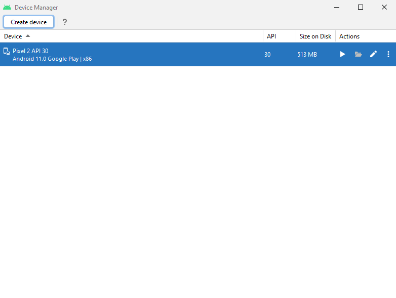
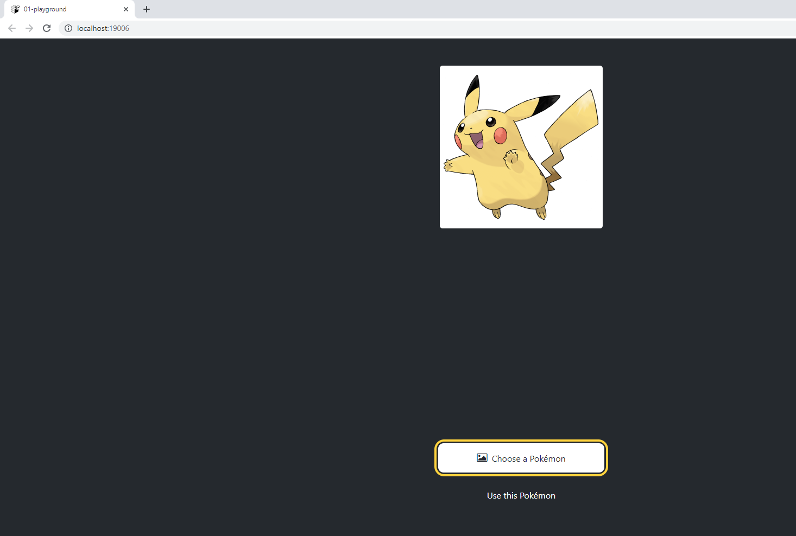
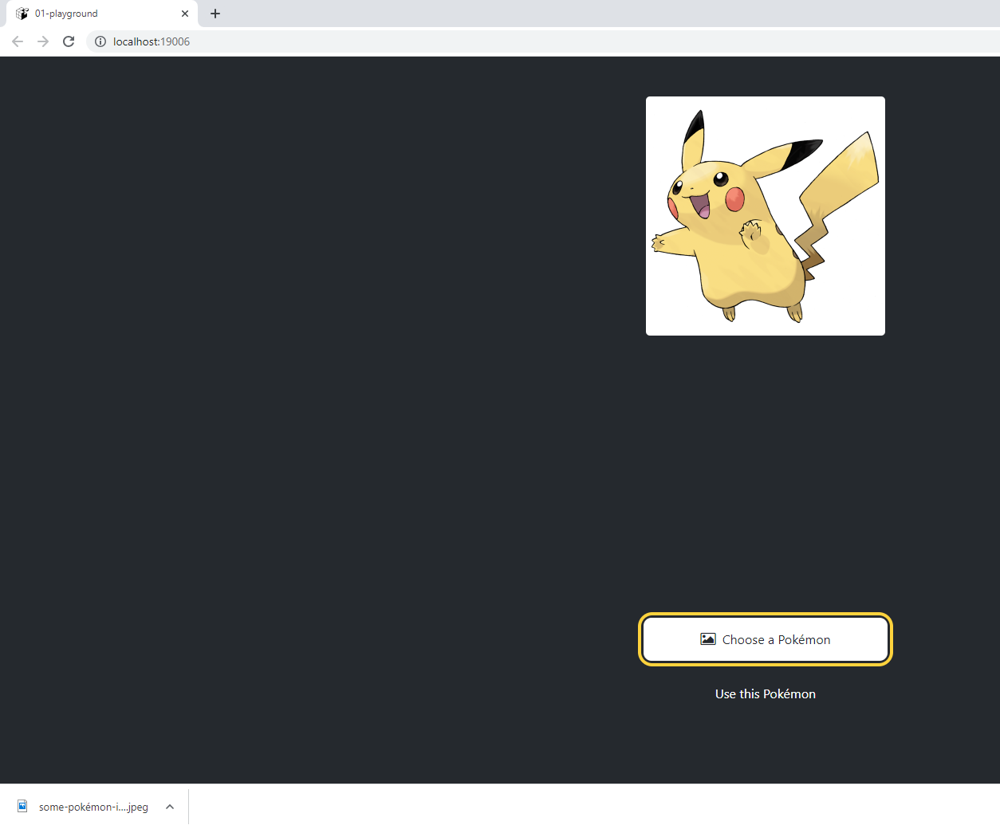

# 01: React Native and Expo

## Environment Variables

On the lab computers, the `ANDROID_HOME` **environment variable** may not be set. To set the `ANDROID_HOME` **environment variable**, follow the steps below:


## Emulator

An **emulator** is a software that mimics the hardware and software of a mobile device. It allows developers to test their applications without having to use a physical device. It is useful for testing applications on different devices.

You will need to download and install an **emulator** to run **React Native** applications on your computer. You can use **Android Studio** or **Xcode** to install an **emulator**. **Android Studio** is an integrated development environment for building **Android** applications. **Xcode** is an integrated development environment for building **iOS** applications. **Android Studio** is available for **Windows**, **macOS**, and **Linux**. **Xcode** is only available for **macOS**.

On the lab computers, **Android Studio** is already installed. To create an **emulator** using **Android Studio**, follow the steps below:

















## React Native

**React Native** is a library for building native mobile applications using **JavaScript** and **React**. It allows developers to create mobile applications for **iOS** and **Android** platforms using a single codebase. **React Native** utilises native components to render the user interface, resulting in highly performant and responsive applications. It combines the power of **React**, a popular **JavaScript** library for building user interfaces, with native platform capabilities. With **React Native**, developers can write code once and deploy it on multiple platforms, saving time and effort in mobile application development.

## Expo

**Expo** is a framework and a platform for building, deploying, and managing **React Native** applications. It provides a set of tools and services that simplify the development and testing of **React Native** applications. **Expo** allows developers to build **React Native** applications without having to install and configure **Android Studio** or **Xcode**. It also provides a set of tools for managing the entire development process, including building, testing, and deploying applications.

## Getting Started

Create a new project using the following command:

```bash
npx create-expo-app 01-playground
```

### File Structure

```bash
01-playground
├── App.js
├── app.json
├── assets
│   ├── adaptive-icon.png
│   ├── favicon.png
│   ├── icon.png
│   └── splash.png
├── babel.config.js
├── package.json
├── package-lock.json
└── node_modules
```

- `App.js` is the entry point of the application.
- `app.json` contains the configuration for the application.
- `assets` contains the images and icons used in the application.
- `babel.config.js` contains the configuration for **Babel**, a **JavaScript** compiler.
- `package.json` contains the dependencies and scripts for the application.
- `package-lock.json` contains the exact versions of the dependencies.
- `node_modules` contains the dependencies.

### App.js

In `App.js`, you should see the following code:

```js
import { StatusBar } from "expo-status-bar";
import { StyleSheet, Text, View } from "react-native";

export default function App() {
  return (
    <View style={styles.container}>
      <Text>Open up App.js to start working on your app!</Text>
      <StatusBar style="auto" />
    </View>
  );
}

const styles = StyleSheet.create({
  container: {
    flex: 1,
    backgroundColor: "#fff",
    alignItems: "center",
    justifyContent: "center",
  },
});
```

- `View` is a container that supports layout with **flexbox**, **style**, **some touch handling**, and **accessibility controls**.
- `Text` is a component for displaying text.
- `StatusBar` is a component for controlling the status bar.

Run the following command:

```bash
npm run android
```

You should see the following:


**Research Tasks:**

- Rename `App.js` to `App.jsx`.
- Convert `App` into an arrow function.
- Change the `backgroundColor`.
- Change the `Text` component's `color`. **Note:** Use the `style` prop.

### ImageViewer.jsx

In the `assets` directory, create a new directory called `imgs`. You have been given a directory of Pokémon images called `pokemon-imgs`. Copy the contents of the `pokemon-imgs` directory into the `imgs` directory.

In the root directory, create a new directory called `components`. In the `components` directory, create a new file called `ImageViewer.jsx`. Add the following code:

```jsx
import { StyleSheet, Image } from "react-native";

const ImageViewer = (props) => (
  <Image source={props.placeholderImgSrc} style={styles.image} />
);

const styles = StyleSheet.create({
  image: {
    width: 300,
    height: 300,
    backgroundColor: "#ffffff",
    borderRadius: 5,
  },
});

export default ImageViewer;
```

- `Image` is a component for displaying images.

### App.jsx

Refactor `App.jsx` to the following:

```jsx
// ...

import ImageViewer from "./components/ImageViewer";

// Choose one of the Pokémon images
const placeholderImg = require("./assets/imgs/pikachu.png");

const App = () => {
  return (
    <View style={styles.container}>
      <View style={styles.imageContainer}>
        <ImageViewer placeholderImgSrc={placeholderImg} />
      </View>
      <StatusBar style="auto" />
    </View>
  );
};

const styles = StyleSheet.create({
  // ...
  imageContainer: {
    flex: 1,
    paddingTop: 50,
  },
});

// ...
```

Reload your application. You should see the following:


### Button.jsx

To use **vector icons**, install the following dependency:

```bash
npm install @expo/vector-icons
```

In the `components` directory, create a new file called `Button.jsx`. Add the following code:

```jsx
import { StyleSheet, View, Pressable, Text } from "react-native";
import FontAwesome from "@expo/vector-icons/FontAwesome";

const Button = (props) => {
  if (props.theme === "primary") {
    return (
      <View
        style={[
          styles.buttonContainer,
          { borderWidth: 4, borderColor: "#ffd33d", borderRadius: 18 },
        ]}
      >
        <Pressable
          style={[styles.button, { backgroundColor: "#fff" }]}
          onPress={() => alert("Pikachu")}
        >
          <FontAwesome
            name="picture-o"
            size={18}
            color="#25292e"
            style={styles.buttonIcon}
          />
          <Text style={[styles.buttonLabel, { color: "#25292e" }]}>
            {props.label}
          </Text>
        </Pressable>
      </View>
    );
  }

  return (
    <View style={styles.buttonContainer}>
      <Pressable style={styles.button} onPress={() => alert("Pikachu")}>
        <Text style={styles.buttonLabel}>{props.label}</Text>
      </Pressable>
    </View>
  );
};

const styles = StyleSheet.create({
  buttonContainer: {
    width: 320,
    height: 68,
    marginHorizontal: 20,
    alignItems: "center",
    justifyContent: "center",
    padding: 3,
  },
  button: {
    borderRadius: 10,
    width: "100%",
    height: "100%",
    alignItems: "center",
    justifyContent: "center",
    flexDirection: "row",
  },
  buttonIcon: {
    paddingRight: 8,
  },
  buttonLabel: {
    color: "#fff",
    fontSize: 16,
  },
});

export default Button;
```

- `Pressable` is a component that detects various stages of press interactions on any of its child components.
- `FontAwesome` is a component that renders **FontAwesome** icons.

### App.jsx

Refactor `App.jsx` to the following:

```jsx
// ...

import Button from "./components/Button";

// ...

const App = () => {
  return (
    <View style={styles.container}>
      <View style={styles.imageContainer}>
        <ImageViewer placeholderImgSrc={placeholderImg} />
      </View>
      <View style={styles.footerContainer}>
        <Button theme="primary" label="Choose a Pokémon" />
        <Button label="Use this Pokémon" />
      </View>
      <StatusBar style="auto" />
    </View>
  );
};

const styles = StyleSheet.create({
  // ...

  footerContainer: {
    flex: 1 / 3,
    alignItems: "center",
  },
});

// ...
```

Reload your application. You should see the following:


What happens when you click on the **Choose a Pokémon** or **Use this Pokémon** buttons?


## Image Picker

We will use the `expo-image-picker` dependency to allow the user to select an image from their device's image library.

### Getting Started

To get started, install the following dependency:

```bash
npm install expo-image-picker
```

### Button.jsx

Refactor the `Button.jsx` to the following:

```jsx
// ...

const Button = (props) => {
  if (props.theme === "primary") {
    return (
      <View
        style={[
          styles.buttonContainer,
          { borderWidth: 4, borderColor: "#ffd33d", borderRadius: 18 },
        ]}
      >
        <Pressable
          style={[styles.button, { backgroundColor: "#fff" }]}
          onPress={props.onPress}
        >
          {/* ... */}
        </Pressable>
      </View>
    );
  }

  /* ... */
};

// ...
```

- `props.onPress` is a function that is passed in as a prop. It is called when the button is pressed.

### App.jsx

Refactor `App.jsx` to the following:

```jsx
// ...

import { launchImageLibraryAsync } from "expo-image-picker";

// ...

const App = () => {
  const pickImageAsync = async () => {
    const result = await launchImageLibraryAsync({
      allowsEditing: true,
      quality: 1,
    });

    if (!result.canceled) {
      console.log(result);
    } else {
      alert("You did not select any Pokémon image.");
    }
  };

  return (
    <View style={styles.container}>
      {/* ... */}
      <View style={styles.footerContainer}>
        <Button
          theme="primary"
          label="Choose a Pokémon"
          onPress={pickImageAsync}
        />
        <Button label="Use this Pokémon" />
      </View>
      <StatusBar style="auto" />
    </View>
  );
};

// ...
```

- `launchImageLibraryAsync` is a function that launches the device's image library. It returns a promise that resolves to an object containing information about the selected image.
- `pickImageAsync` is an asynchronous function that calls `launchImageLibraryAsync` and logs `result` to the console if the user selects an image. Otherwise, it alerts the user that they did not select an image. We will refactor this function later to display the selected image.
- `onPress={pickImageAsync}` is a prop that is passed to the **Choose a Pokémon** button. It calls the `pickImageAsync` function when the button is pressed.

Reload your application. You should see the following when you click on the **Choose a Pokémon** button:


**Research Task:**

Refactor the code so that when the user selects an image, it is displayed on the screen.

To get started, you will need to refactor `ImageViewer.jsx` to the following:

```jsx
// ...

const ImageViewer = (props) => {
  const imgSrc =
    props.selectedImg !== null
      ? { uri: props.selectedImg }
      : props.placeholderImgSrc;

  return <Image source={imgSrc} style={styles.image} />;
};

// ...
```

- `props.selectedImg` is a string that contains the URI of the selected image. If the user has not selected an image, it is `null`.

**How do we get the URI of the selected image?** Look at the `result` object that is logged to the console when you select an image.

Once you have refactored the code, you should see the following when you select an image:


## Take a Screenshot

We will use the `react-native-view-shot` dependency to take a screenshot of the image that is displayed on the screen.

### Getting Started

To get started, install the following dependencies:

```bash
npm install react-native-view-shot expo-media-library
```

### Button.jsx

Refactor the `Button.jsx` to the following:

```jsx
// ...

const Button = (props) => {
  // ...

  return (
    <View style={styles.buttonContainer}>
      <Pressable style={styles.button} onPress={props.onPress}>
        <Text style={styles.buttonLabel}>{props.label}</Text>
      </Pressable>
    </View>
  );
};

// ...
```

- `props.onPress` is a function that is passed in as a prop. It is called when the button is pressed.

### App.jsx

Refactor `App.jsx` to the following:

```jsx
// ...

import { saveToLibraryAsync, usePermissions } from "expo-media-library";
import { useRef } from "react";
import { captureRef } from "react-native-view-shot";

// ...

const App = () => {
  // ...
  const [status, requestPermission] = usePermissions();

  const imageRef = useRef();

  if (status === null) requestPermission(); // Request permission to access the media library

  // ...

  const onSaveImageAsync = async () => {
    try {
      const localUri = await captureRef(imageRef, {
        height: 440,
        quality: 1,
      });

      await saveToLibraryAsync(localUri);

      if (localUri) alert("Saved!");
    } catch (err) {
      console.log(err);
    }
  };

  return (
    <View style={styles.container}>
      <View style={styles.imageContainer}>
        <View ref={imageRef} collapsable={false}>
          <ImageViewer
            placeholderImgSrc={placeholderImg}
            selectedImg={selectedImg}
          />
        </View>
      </View>
      <View style={styles.footerContainer}>
        <Button
          theme="primary"
          label="Choose a Pokémon"
          onPress={pickImageAsync}
        />
        <Button label="Use this Pokémon" onPress={onSaveImageAsync} />
      </View>
      <StatusBar style="auto" />
    </View>
  );
};

// ...
```

- `usePermissions` is a hook that requests permission to access the device's media library. It returns an array containing the status of the permission request and a function that requests permission.
- `imageRef` is a reference to the `View` that contains the image.
- `onSaveImageAsync` is an asynchronous function that takes a screenshot of the image and saves it to the device's media library. It also displays an alert if the image is saved successfully.

Reload your application. You should see the following:


**Research Task:**

With **React Native**, you can run your application in a web browser. Using online resources, research and implement this feature.

Once you have implemented this feature, you should see the following when you run your application in a web browser:



## Web Browser

We will look at how to download the image when the user clicks on the **Use this Pokémon** button when the application is running in a web browser.

### Getting Started

To get started, install the following dependency:

```bash
npm install dom-to-image
```

### App.jsx

In `App.jsx`, import the following:

```jsx
import { StyleSheet, View, Platform } from "react-native";
import { toJpeg } from "dom-to-image";
```

- `Platform` is a module that provides information about the platform that the application is running on.
- `toJpeg` is a function that takes a screenshot of the image and returns a data URL.

Add the following to the `onSaveImageAsync` function:

```jsx
const onSaveImageAsync = async () => {
  if (Platform.OS !== "web") {
    // Check if the application is running in a web browser
    try {
      const localUri = await captureRef(imageRef, {
        height: 440,
        quality: 1,
      });
      await saveToLibraryAsync(localUri);
      if (localUri) {
        alert("Saved!");
      }
    } catch (err) {
      console.log(err);
    }
  } else {
    // If the application is running in a web browser
    try {
      const dataUrl = await toJpeg(imageRef.current, {
        // Take a screenshot of the image
        quality: 0.95,
        width: 320,
        height: 440,
      });

      const link = document.createElement("a");
      link.download = "some-img.jpeg"; // Set the name of the downloaded file
      link.href = dataUrl;
      link.click();
    } catch (err) {
      console.log(err);
    }
  }
};
```

Reload your application. You should see the following when you click on the **Use this Pokémon** button:


