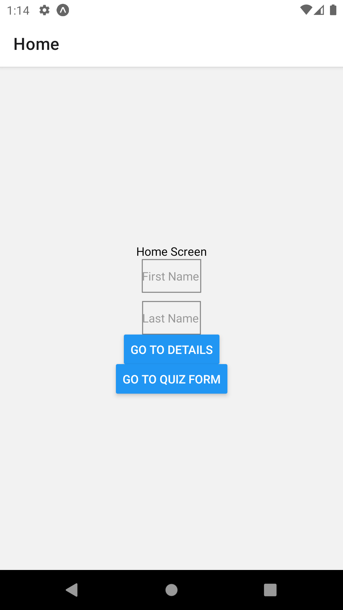
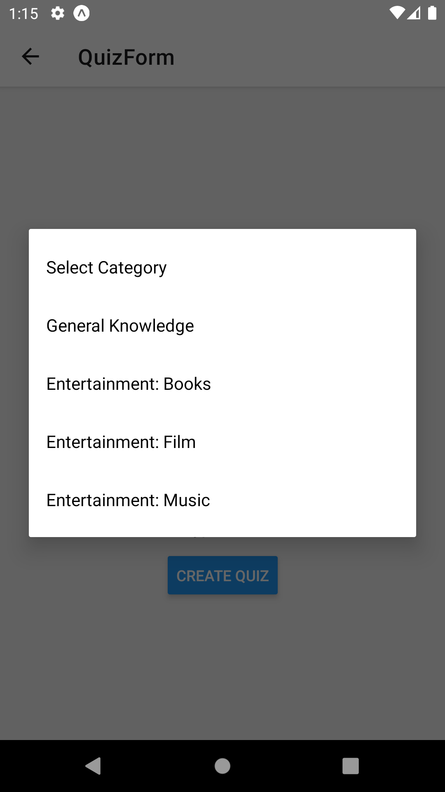
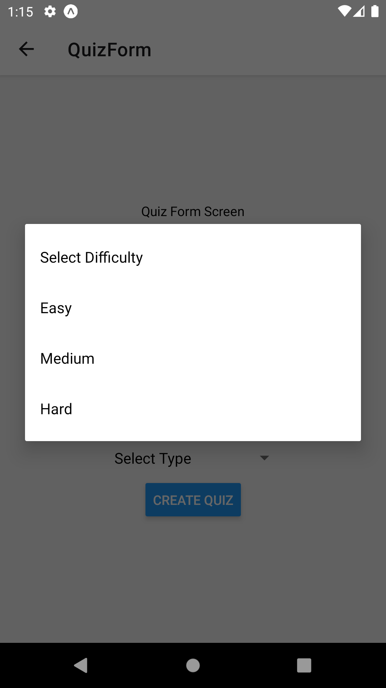
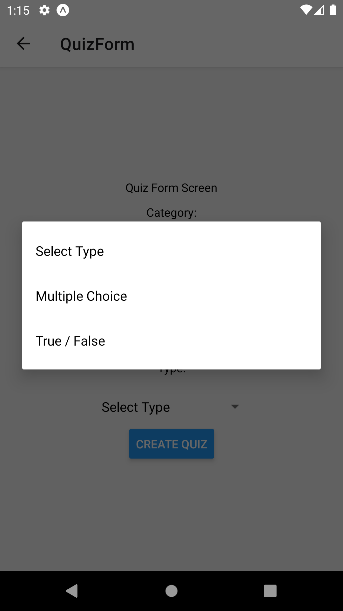
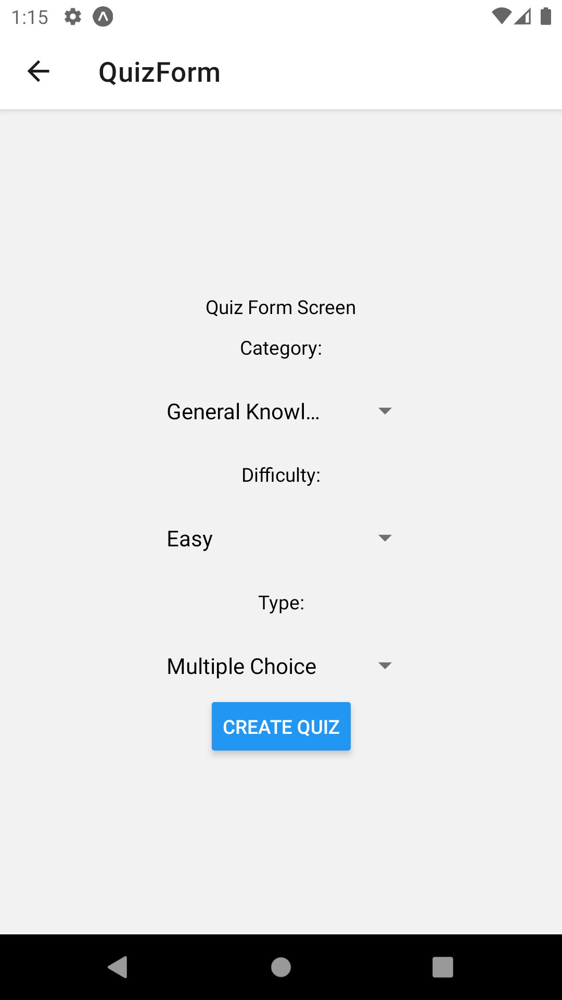
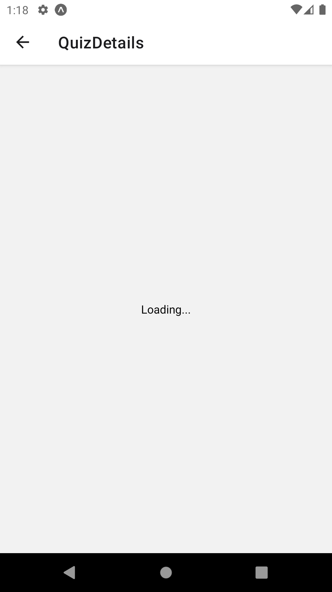

# 03: Async Storage

## Getting Started

Create a new project using the following command:

```bash
npx create-expo-app 03-playground
```

## Async Storage

**Async storage** is a simple, unencrypted, asynchronous, persistent, key-value storage system that is global to the application.

### Getting Started

To get started, install the following dependency:

```bash
npm install @react-native-async-storage/async-storage
```

### App.jsx

Use the knowledge and skills gained from the `02-navigation` lecture to implement **stack navigation**.

```jsx
import { NavigationContainer } from "@react-navigation/native";
import { createNativeStackNavigator } from "@react-navigation/native-stack";

import HomeScreen from "./screens/HomeScreen";
import DetailsScreen from "./screens/DetailsScreen";

const Stack = createNativeStackNavigator();

const App = () => {
  return (
    <NavigationContainer>
      <Stack.Navigator initialRouteName="Home">
        <Stack.Screen name="Home" component={HomeScreen} />
        <Stack.Screen name="Details" component={DetailsScreen} />
      </Stack.Navigator>
    </NavigationContainer>
  );
};

export default App;
```

### HomeScreen.jsx

In the root directory, create a new directory called `screens`. In the `screens` directory, create a new file called `HomeScreen.jsx`. Add the following code:

```jsx
import { Button, View, Text, TextInput } from "react-native";
import { useState } from "react";
import AsyncStorage from "@react-native-async-storage/async-storage";

const HomeScreen = (props) => {
  const [firstName, setFirstName] = useState("");
  const [lastName, setLastName] = useState("");

  const onChangeFirstName = (inputText) => setFirstName(inputText);
  const onChangeLastName = (inputText) => setLastName(inputText);

  const storePersonData = async () => {
    try {
      const data = { firstName, lastName };
      await AsyncStorage.setItem("person_data", JSON.stringify(data));
      setFirstName("");
      setLastName("");
    } catch (err) {
      console.log(err);
    }
  };

  return (
    <View style={{ flex: 1, alignItems: "center", justifyContent: "center" }}>
      <Text>Home Screen</Text>
      <TextInput
        style={{
          height: 40,
          borderColor: "gray",
          borderWidth: 1,
          marginBottom: 10,
        }}
        onChangeText={onChangeFirstName}
        value={firstName}
        placeholder="First Name"
      />
      <TextInput
        style={{ height: 40, borderColor: "gray", borderWidth: 1 }}
        onChangeText={onChangeLastName}
        value={lastName}
        placeholder="Last Name"
      />
      <Button
        title="Go to Details"
        onPress={() => {
          storePersonData();
          props.navigation.navigate("Details");
        }}
      />
    </View>
  );
};

export default HomeScreen;
```

Reload your application. You should see the following: 


### DetailsScreen.jsx

In the `screens` directory, create a new file called `DetailsScreen.jsx`. Add the following code:

```jsx
import { Button, View, Text } from "react-native";
import { useEffect, useState } from "react";
import AsyncStorage from "@react-native-async-storage/async-storage";

const DetailsScreen = (props) => {
  const [data, setData] = useState(null);

  useEffect(() => {
    getData();
  }, []);

  const getData = async () => {
    try {
      const value = await AsyncStorage.getItem("person_data");
      if (value !== null) {
        const parsedData = JSON.parse(value);
        setData(parsedData);
      }
    } catch (err) {
      console.log(err);
    }
  };

  return (
    <View style={{ flex: 1, alignItems: "center", justifyContent: "center" }}>
      <Text>Details Screen</Text>
      {data && (
        <View>
          <Text>First Name: {data.firstName}</Text>
          <Text>Last Name: {data.lastName}</Text>
        </View>
      )}
      <Button title="Go back" onPress={() => props.navigation.goBack()} />
    </View>
  );
};

export default DetailsScreen;
```

Reload your application. You should see the following: 


**Research Tasks:**














